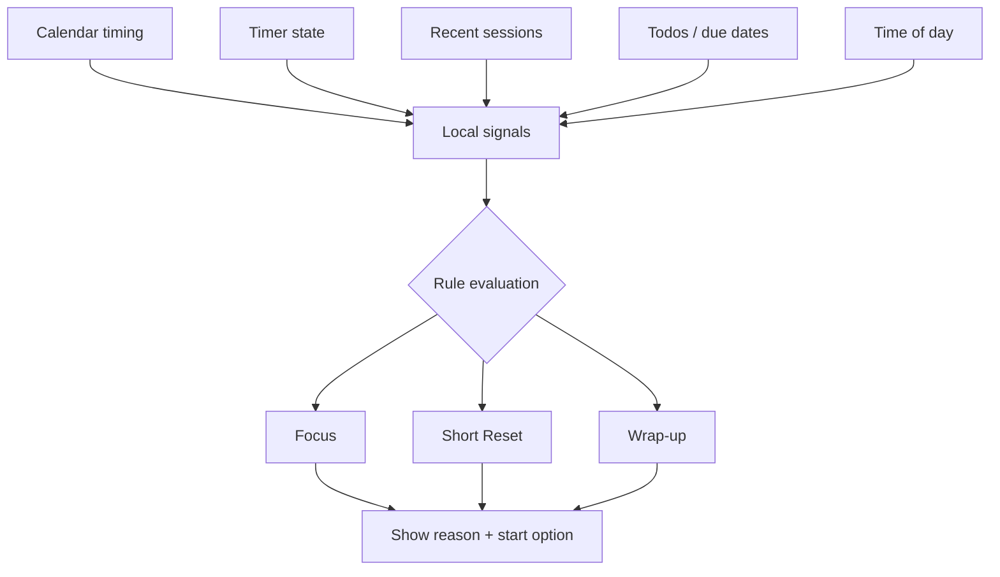
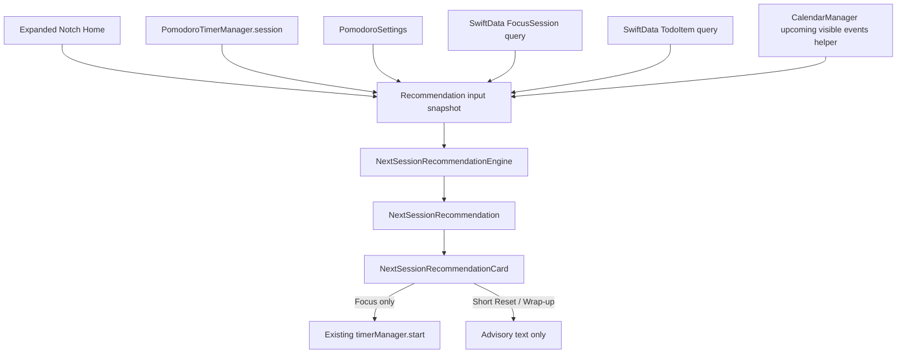

# Next Session Recommendation - Plan

## Goal Capsule

- **Objective:** Add a local, rule-based recommendation that tells the user which session type to start next: Focus, Short Reset, or Wrap-up.
- **Product authority:** The MVP should make Pace feel like it nudges the user's next mode, not like it manages the whole day.
- **Planning resolution:** The first implementation ships on the expanded Notch Home surface, backed by a local pure-rule engine and a small calendar snapshot helper.
- **Execution profile:** Code implementation. Do not add a SwiftData model, package dependency, entitlement, background service, or AI/network inference path for v1.
- **Stop conditions:** Stop before implementation if the plan would require changing the timer state machine to represent Wrap-up as a runnable timer mode, because v1 treats Wrap-up as an advisory recommendation label.

---

## Product Contract

### Summary

Pace will recommend the next session type using local, explainable rules rather than AI.
The MVP recommends only Focus, Short Reset, or Wrap-up, with a short reason based on calendar timing, timer state, recent session history, todos, and time of day.

### Problem Frame

Pace already has the pieces for a rhythm-aware product: persisted focus sessions, todos, calendar events, music playback, a notch/glance surface, and timer analytics.
Today those pieces mostly sit beside the timer rather than helping the user decide what mode fits the current moment.
The first useful step toward Autopace is not a full-day planner; it is a small recommendation that answers, "What kind of session should I do next?"

### Key Decisions

- **Rules over AI.** Recommendations are deterministic and locally explainable so users can trust the reason and the feature can ship without LLM cost, latency, privacy concerns, or unpredictable phrasing.
- **Next session over full-day planning.** The MVP recommends one immediate mode rather than compiling an entire day rhythm.
- **Three types only.** Focus, Short Reset, and Wrap-up are enough to test value while keeping rule explanations simple.
- **Tasks inform, but do not dominate.** The output is the session type, not a chosen task; task selection can come later.
- **Recommendation is advisory.** The user can ignore it and still start the existing timer flow.

### Requirements

**Recommendation Output**

- R1. Pace must recommend exactly one of three session types: Focus, Short Reset, or Wrap-up.
- R2. Every recommendation must include a short user-readable reason that names the strongest signal behind it.
- R3. The recommendation must be local and rule-based; it must not require an LLM, remote inference, or AI-generated copy.
- R4. The recommendation must never block manual timer controls.

**Rule Inputs**

- R5. The recommender must consider upcoming calendar timing when calendar data is available.
- R6. The recommender must consider current timer/session state so it does not suggest a conflicting mode.
- R7. The recommender must consider recent completed or skipped focus sessions when session history is available.
- R8. The recommender may consider active todos and due dates, but it must not promise automatic task selection in the MVP.
- R9. The recommender may consider time of day for wrap-up behavior.

**Session Type Semantics**

- R10. Focus means the user appears to have enough space for a normal focus block.
- R11. Short Reset means the user should restart gently because a full focus block is poorly timed or the recent rhythm looks broken.
- R12. Wrap-up means the user should close loops, review, or prepare rather than start another full focus attempt.

**Trust and Explainability**

- R13. The UI must make the recommendation feel optional rather than prescriptive.
- R14. If the available signals are insufficient, Pace must either show a conservative default or show no recommendation rather than inventing confidence.
- R15. The recommendation reason must avoid implying hidden surveillance; it should reference only understandable signals such as calendar timing, recent skips, or end-of-day timing.

### Key Flow

- F1. User opens Pace while idle
  - **Trigger:** The user opens the main Pace surface or notch while no session is actively running.
  - **Steps:** Pace evaluates local signals, chooses Focus / Short Reset / Wrap-up, and shows the recommendation with a reason.
  - **Outcome:** The user can start the suggested session or use existing manual controls.
  - **Covered by:** R1, R2, R4, R13.

- F2. Calendar-constrained moment
  - **Trigger:** The user has an upcoming event too soon for a full focus block.
  - **Steps:** Pace avoids recommending Focus and favors Short Reset or Wrap-up depending on the timing and time of day.
  - **Outcome:** The user understands that the recommendation is driven by the next calendar constraint.
  - **Covered by:** R5, R10, R11, R12, R15.

- F3. Broken rhythm moment
  - **Trigger:** Recent session history shows skipped or incomplete focus attempts.
  - **Steps:** Pace favors Short Reset and explains the recommendation in terms of restarting gently.
  - **Outcome:** The user gets a recovery-oriented nudge instead of another full-pressure focus block.
  - **Covered by:** R7, R11, R13.

### Conceptual Flow

### Acceptance Examples

- AE1. **Covers R1, R2, R5, R10.** Given the user is idle and has a long open calendar window, when Pace evaluates the next session, then it recommends Focus and explains that there is enough time for a focus block.
- AE2. **Covers R2, R5, R11.** Given the user is idle and has a meeting soon, when Pace evaluates the next session, then it recommends Short Reset and explains that a full focus block is poorly timed.
- AE3. **Covers R7, R11, R13.** Given the user recently skipped a running session, when Pace evaluates the next session, then it can recommend Short Reset without framing the skip as failure.
- AE4. **Covers R9, R12.** Given it is late in the user's working day, when Pace evaluates the next session, then it can recommend Wrap-up and explain that closing loops is more appropriate than starting a full focus block.
- AE5. **Covers R3, R15.** Given the recommendation appears, when the user reads its reason, then the reason references local understandable signals and does not mention AI.
- AE6. **Covers R4, R14.** Given Pace cannot confidently choose a recommendation, when the user opens the timer, then existing manual controls remain available.

### Success Criteria

- A user can understand why Pace suggested the displayed session type without opening settings or documentation.
- The MVP can be tested without network inference or AI infrastructure.
- Existing manual timer behavior remains usable when recommendations are absent, ignored, or wrong.
- The feature creates a clear path toward later daily rhythm planning without requiring that larger scope in v1.

### Scope Boundaries

**Deferred for later**

- Full-day rhythm compilation from calendar and tasks.
- AI-generated recommendations or natural-language planning.
- Automatic task selection as the primary output.
- Admin and Break session types.
- Adaptive music changes driven by recommendation state.

**Outside this MVP**

- Screenshot, keylogging, or app/window surveillance.
- Replacing existing Pomodoro controls.
- Rewriting the calendar integration or task system as part of this feature.

### Dependencies / Assumptions

- Pace already persists `FocusSession` records and timer skip behavior.
- Pace already has todo items with due dates and visible active todos.
- Pace already aggregates calendar data from system and Google calendar sources.
- Pace already has notch, dashboard, and timer surfaces where a recommendation could appear.
- The plan assumes recommendation display can start on one surface first; planning should choose the smallest coherent surface.

### Sources / Research

- `docs/ideation/2026-06-28-open-ideation.html` — source ideation artifact for the Pace Compiler / Autopace direction.
- `Pace/Managers/Timer/PomodoroTimerManager.swift` — timer start, skip, persistence, and session transition behavior.
- `Pace/Models/Timer/FocusSession.swift` — persisted focus and break session model.
- `Pace/Models/Todo/TodoItem.swift` — todo data including due dates.
- `Pace/Managers/Calendar/CalendarManager.swift` — calendar aggregation and write capability state.
- `Pace/Managers/Calendar/GoogleCalendarManager.swift` — Google Calendar auth, scope, cache, and event data state.
- `Pace/Views/Notch/NotchExpandedView.swift` — current notch home, music, and calendar surfaces.
- `docs/landingpage/messages/en.json` — existing public roadmap copy for automatically suggesting focus sessions for empty slots.

---

## Planning Contract

### Product Contract Preservation

The Product Contract above remains the source of product truth from `ce-brainstorm`.
This planning pass resolves the implementation blockers without widening the MVP: recommendations stay local, deterministic, advisory, and limited to Focus / Short Reset / Wrap-up.

### Key Technical Decisions

- KTD1. **Use a pure snapshot-based engine.** Put the recommendation model and rule engine outside SwiftUI so the rules can be unit-tested without a running app, SwiftData container, calendar permissions, or UI automation. The view gathers snapshots from existing state; the engine only receives plain values and returns a `NextSessionRecommendation`.
- KTD2. **Do not persist recommendation history in v1.** `FocusSession` and `TodoItem` already cover the input signals. Adding a SwiftData model would require schema registration and migration work in `Pace/PaceApp.swift`, which does not serve the advisory MVP.
- KTD3. **Ship the expanded Notch Home surface first.** The recommendation belongs closest to Pace's glance surface, where the user decides the next mode without opening a full dashboard. The closed notch remains too small for explainable reason text, so v1 targets `Pace/Views/Notch/NotchExpandedView.swift` and leaves `Pace/Views/Notch/NotchHomeView.swift` unchanged.
- KTD4. **Treat Wrap-up and Short Reset as advisory labels, not timer states.** `PomodoroTimerManager.start()` starts/resumes the current Pomodoro state and idle always moves to Focus. V1 must not add a Wrap-up timer state or reinterpret Short Reset as a short-break timer without a separate product decision.
- KTD5. **Use visible aggregated calendar events through a narrow helper.** `CalendarManager` already merges system and Google events while honoring visibility settings, but the merged list is private. Add a read-only helper that returns upcoming visible, non-all-day events for recommendation windows rather than duplicating aggregation logic in the UI.
- KTD6. **Infer broken rhythm conservatively.** Current `FocusSession` records do not distinguish completed, skipped, and intentionally short sessions. V1 can infer disruption only from recent short focus sessions and must not say the user skipped unless skip state is explicitly modeled later.

### Rule Defaults

- RD1. Focus is the default when the timer is idle, no stronger rule applies, and the app lacks enough signal for a more specific recommendation.
- RD2. A timed calendar event makes Focus poorly timed when it starts before `focusDuration + 5 minutes` from now.
- RD3. When a timed event is within 15 minutes, prefer Short Reset unless the local hour is at or after 17:00, in which case prefer Wrap-up.
- RD4. Broken rhythm means at least two focus sessions in the last 4 hours with duration less than 50% of the current focus duration.
- RD5. Time-of-day Wrap-up applies at or after 17:00 local time only when the timer is idle and no stronger calendar-immediacy rule applies.
- RD6. Todos can strengthen the reason copy when active due items exist, but they do not select a task or override calendar/timer safety in v1.
- RD7. Calendar reasons may mention only actual visible timed events. If calendar data is unavailable or empty, do not claim the user's calendar is clear.

### High-Level Technical Design

### Sequencing

Implement the pure domain model and tests first, then the calendar snapshot helper, then the expanded Notch UI integration.
Keep the rule engine free of `SwiftUI`, `SwiftData`, `EventKit`, `CalendarManager`, and `PomodoroTimerManager` types so tests can exercise the full precedence order without app setup.

### Risks & Constraints

- Swift 6 default `MainActor` isolation applies to the app target and test target. Keep UI-facing integration on the main actor, but make the engine inputs simple enough to avoid unnecessary actor coupling.
- Calendar state may be unauthorized, disabled, hidden, cached, or still loading. The recommendation should degrade to timer/session/time-of-day signals instead of inventing confidence.
- `FocusSession` cannot prove a session was skipped. Reason copy should say "recent short focus attempts" or "restart gently", not "you skipped sessions".
- Release learnings warn against unnecessary target, signing, or dependency churn. This feature should not change `Package.swift`, entitlements, Sparkle release scripts, or app metadata.

---

## Implementation Units

### U1. Add Recommendation Domain Model and Pure Engine

- **Goal:** Introduce the stable output contract and deterministic rule precedence.
- **Requirements:** R1, R2, R3, R6, R7, R8, R9, R10, R11, R12, R14, R15.
- **Files:** `Pace/Models/Recommendation/NextSessionRecommendation.swift`, `Pace/Managers/Recommendation/NextSessionRecommendationEngine.swift`, `Tests/PaceTests/NextSessionRecommendationEngineTests.swift`.
- **Approach:** Define a recommendation type enum for Focus, Short Reset, and Wrap-up; a reason enum or static reason fields; a plain input snapshot with timer state, focus duration, now, upcoming events, recent sessions, and active todos; and a single evaluation method with explicit rule order matching RD1-RD7.
- **Test Scenarios:** Focus default with idle timer and no signals; Short Reset when next event is inside `focusDuration + 5 minutes`; Wrap-up after 17:00 with near event or end-of-day signal; Short Reset for two recent short focus sessions; no calendar-clear reason when event input is empty; active/running timer returns no card or a non-conflicting advisory according to the chosen engine contract.
- **Verification:** `swift test --filter NextSessionRecommendationEngineTests`.

### U2. Expose Calendar Snapshot Input

- **Goal:** Let the recommender consume visible upcoming calendar constraints without copying calendar aggregation logic into the Notch UI.
- **Requirements:** R5, R14, R15.
- **Files:** `Pace/Managers/Calendar/CalendarManager.swift`, `Tests/PaceTests/NextSessionRecommendationEngineTests.swift` or a focused calendar helper test if the helper is pure enough.
- **Approach:** Add a small read-only method on `CalendarManager` that returns upcoming visible non-all-day events in a date interval from the already aggregated event data. The helper should filter nil start dates, all-day events, ended events, and events outside the requested window.
- **Test Scenarios:** Event inside the window is returned; all-day event is ignored; hidden/source filtering remains delegated to existing aggregation; unavailable calendar data returns an empty array without error.
- **Verification:** `swift test --filter NextSessionRecommendation`.

### U3. Integrate on Expanded Notch Home

- **Goal:** Show the optional recommendation in Pace's glance surface where the user already checks timer state and quick tasks.
- **Requirements:** R1, R2, R4, R6, R8, R13, AE1, AE2, AE3, AE4, AE5, AE6.
- **Files:** `Pace/Views/Notch/NotchExpandedView.swift`, optionally `Pace/Views/Shared/Recommendation/NextSessionRecommendationCard.swift` if extracting the card keeps the notch view readable.
- **Approach:** Add `@Query` inputs for recent `FocusSession` and active `TodoItem` data, observe `CalendarManager.shared`, compute the recommendation from snapshots, and render a compact card above the existing compact timer/tasks pair in the expanded Home tab. Keep the existing play/pause button unchanged. If the recommendation is Focus, the card may include a start action that calls existing `timerManager.start()`; Short Reset and Wrap-up stay advisory unless a later unit adds dedicated timer semantics.
- **Test Scenarios:** The card appears when the expanded notch Home tab is idle and a recommendation exists; existing reset/play/skip controls remain available; recommendation text does not cover or resize core timer/task controls; no card or neutral state appears when signals are insufficient or timer state conflicts.
- **Verification:** `swift build` plus manual expanded-notch smoke check through `./script/build_and_run.sh`.

### U4. Add Focused Regression Coverage

- **Goal:** Prove the rule behavior and existing timer behavior survive the UI integration.
- **Requirements:** R3, R4, R10, R11, R12, R14, R15.
- **Files:** `Tests/PaceTests/NextSessionRecommendationEngineTests.swift`, `Tests/PaceTests/CalendarAndTimerRegressionTests.swift` only if an existing regression needs expansion.
- **Approach:** Prefer pure engine tests for rule ordering and reason text constraints. Add an integration-style test only if the calendar helper exposes pure enough data to test without EventKit authorization. Do not add brittle SwiftUI snapshot tests for the card in v1.
- **Test Scenarios:** Focus, Short Reset, Wrap-up, broken-rhythm inference, calendar-unavailable fallback, active timer/manual controls unchanged.
- **Verification:** `swift test`.

---

## Verification Contract

| Check | Command | Applies To | Exit Signal |
|---|---|---|---|
| Engine regression tests | `swift test --filter NextSessionRecommendationEngineTests` | U1, U4 | All recommendation precedence and reason tests pass. |
| Existing timer/calendar regressions | `swift test --filter CalendarAndTimerRegressionTests` | U2, U4 | Existing disconnect and timer skip behavior still pass. |
| Full SwiftPM test suite | `swift test` | All units | App and test targets compile under Swift 6 and all tests pass. |
| Build smoke | `swift build` | All units | App target compiles without adding dependencies or target changes. |
| Local app smoke | `./script/build_and_run.sh` | U3 | The app opens, expanded Notch Home can render the recommendation card, and the recommendation card does not block manual timer usage. |

Release validation with `scripts/release_update.sh` is not required unless implementation changes package dependencies, signing, entitlements, app metadata, Sparkle artifacts, or target configuration.

---

## Definition of Done

- Product Contract remains satisfied and no requirement is silently dropped.
- The plan is implemented without AI inference, network calls, new dependencies, new entitlements, or new persisted recommendation state.
- `NextSessionRecommendationEngine` is testable without SwiftUI, SwiftData, EventKit authorization, or app launch.
- Expanded Notch Home shows one optional recommendation with a short local-signal reason when appropriate.
- Existing timer controls remain the source of truth; manual start/pause/reset/skip behavior is unchanged.
- Short Reset and Wrap-up do not mutate timer state in v1 unless a later product contract explicitly defines that behavior.
- Tests in the Verification Contract pass, or any failure is documented with the exact failing command and cause.
- Dead-end experimental code, unused UI branches, and stale debug output are removed before final handoff.
